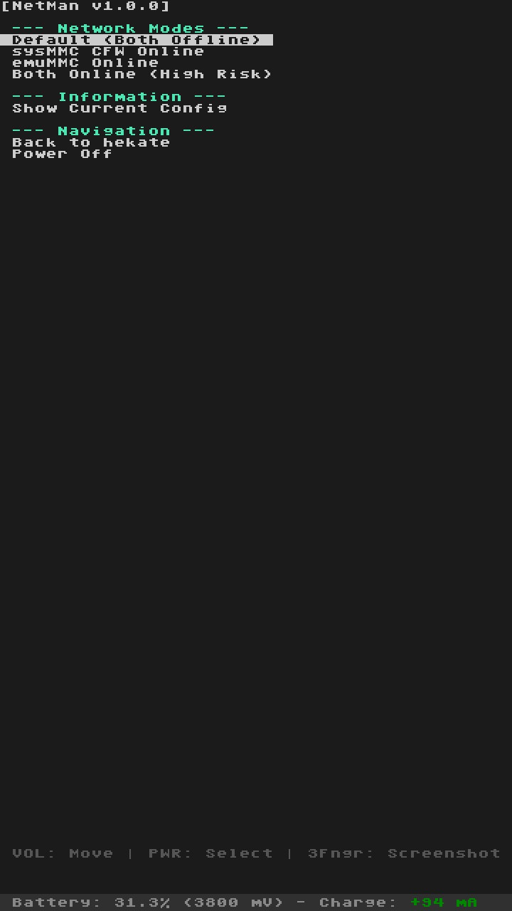

# NetMan v1.0.0

**A simple Nintendo Switch network configuration tool for managing online/offline modes.**

NetMan helps you easily switch between different network configurations on your Nintendo Switch, allowing you to control when your sysMMC or emuMMC can connect to Nintendo's servers.

<div align="center">
  
  <br>
  <em>NetMan's clean and intuitive interface</em>
</div>

## 🌟 Features

- **4 Network Modes**: Choose exactly what can connect online
- **Current Config Display**: See your active network settings at a glance  
- **Risk-aware Interface**: Clear warnings help you understand each mode
- **Easy Navigation**: Return to hekate or power off directly from the menu
- **One-click Setup**: Apply complete configurations instantly

## 📱 Network Modes

### 🛡️ **Default (Both Offline)** - *Recommended*
- **sysMMC**: Offline (blocked from Nintendo Online Service)
- **emuMMC**: Offline (blocked from Nintendo Online Service)
- **Risk Level**: ✅ **Safe** - No ban risk
- **Best for**: General homebrew use, piracy protection

### ⚠️ **sysMMC Online** 
- **sysMMC**: Online (can connect to Nintendo Online Service)
- **emuMMC**: Offline (blocked from Nintendo Online Service)  
- **Risk Level**: 🟡 **Medium** - Some ban risk on sysMMC
- **Best for**: Playing legitimate games online while keeping emuMMC safe

### ⚠️ **emuMMC Online**
- **sysMMC**: Offline (blocked from Nintendo Online Service)
- **emuMMC**: Online (can connect to Nintendo Online Service)
- **Risk Level**: 🟡 **Medium** - Some ban risk on emuMMC
- **Best for**: Testing or when you need emuMMC online features

### 🚨 **Both Online (High Risk)**
- **sysMMC**: Online (can connect to Nintendo Online Service)
- **emuMMC**: Online (can connect to Nintendo Online Service)
- **Risk Level**: 🔴 **High** - Maximum ban risk
- **Best for**: Advanced users who understand the risks

## 🚀 Installation

1. **Download** the latest `netman.bin` from [Releases](https://github.com/sthetix/NetMan/releases)
2. **Copy** the file to your SD card bootloader/payloads folder
3. **Launch** Hekate, select Payloads, and choose NetMan.bin
4. **Navigate** the menu using the console Volume UP / Down and Power button

## 📖 How to Use

1. **Launch NetMan** from Hekate payloads menu
2. **Choose** your desired network mode from the menu
3. **Read the warnings** carefully for risky modes
4. **Confirm** your selection when prompted
5. **Launch** your sysMMC CFW / emuMMC

The tool will automatically configure all necessary files for your chosen mode.

## ⚙️ What It Does

NetMan modifies these configuration files on your SD card:
- `exosphere.ini` - Controls console identifier blanking
- `atmosphere/hosts/default.txt` - DNS blocking rules  
- `atmosphere/hosts/sysmmc.txt` - sysMMC-specific DNS rules
- `atmosphere/hosts/emummc.txt` - emuMMC-specific DNS rules
- `atmosphere/config/system_settings.ini` - DNS MITM settings

## ⚠️ Important Warnings

- **Understand the risks** before using online modes
- **Nintendo can detect** unauthorized modifications and ban consoles
- **Default mode is safest** - use it unless you specifically need online access
- **No warranty** - use at your own risk
- **Always backup** your original configuration files

## 🛡️ Safety Tips

- Start with **Default mode** for maximum protection
- Only use online modes if you **understand the consequences**
- **Clean installations** have lower ban risk than modded games
- **Don't use online modes** with pirated content
- **Monitor ban risk** discussions in homebrew communities

## 💾 Building from Source

If you want to compile NetMan yourself:

```bash
# Make sure you have devkitPro and devkitA64 installed
make clean
make
```

The compiled `netman.bin` will be in the `output/` directory.

## 🤝 Contributing

Found a bug or want to improve NetMan? Contributions are welcome!

1. Fork this repository
2. Create your feature branch (`git checkout -b feature/improvement`)
3. Commit your changes (`git commit -m 'Add some improvement'`)
4. Push to the branch (`git push origin feature/improvement`)
5. Open a Pull Request

## 📄 License

This project is licensed under the GNU General Public License v2.0 - see the [LICENSE](LICENSE) file for details.

## 🙏 Credits

- **Based on** the hwfly-toolbox framework
- **Built with** hekate bootloader libraries  
- **Inspired by** the Nintendo Switch homebrew community
- **Special thanks** to all the developers who made Switch homebrew possible

## 📞 Support

- **Issues**: Report bugs or request features in [GitHub Issues](https://github.com/sthetix/NetMan/issues)
- **Community**: Join discussions in Nintendo Switch homebrew communities
- **Updates**: Watch this repository for new releases and improvements

---

### Support My Work

If you find this project useful, please consider supporting me by buying me a coffee!

<a href="https://www.buymeacoffee.com/sthetixofficial" target="_blank">
  
</a>

**Remember: With great power comes great responsibility. Use NetMan wisely! 🎮**