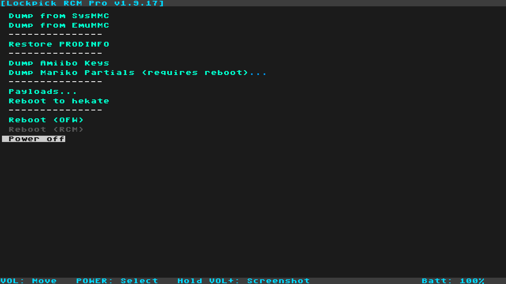

# NetMan

**A simple Nintendo Switch payload for toggling sysMMC network blocking.**

NetMan currently focuses on one job: quickly switching sysMMC between a blocked and unblocked network configuration from RCM.

<div align="center">
  
  <br>
  <em>NetMan's simple sysMMC network controls</em>
</div>

## Features

- **Block sysMMC** from Nintendo network connectivity
- **Unblock sysMMC** for normal Nintendo network connectivity
- **Current config display** for the active SD card settings
- **Hekate launcher shortcut** when `bootloader/update.bin` is available
- **Power off option** from the payload menu

## What NetMan Changes

NetMan updates Atmosphere configuration files on the SD card:

- `exosphere.ini`
- `atmosphere/hosts/sysmmc.txt`
- `atmosphere/hosts/default.txt`
- `atmosphere/config/system_settings.ini`
- `config/sys-patch/config.ini`

When sysMMC blocking is enabled, NetMan blanks sysMMC PRODINFO through exosphere settings, writes Nintendo server blocking rules for sysMMC, enables DNS MITM, disables default DNS blocking, and enables sys-patch network and firmware update blocking patches.

When sysMMC is unblocked, NetMan disables sysMMC PRODINFO blanking, clears the sysMMC Nintendo hosts block, keeps DNS MITM enabled with defaults disabled, keeps sys-patch network patches enabled, and allows firmware updates again.

## Current Scope

NetMan does **not** currently provide separate emuMMC online/offline modes. The available actions are only:

- **Set default config**: block sysMMC
- **Set sysMMC online**: unblock sysMMC

## Installation

1. Download the latest `NetMan.bin` from [Releases](https://github.com/sthetix/NetMan/releases).
2. Copy it to `bootloader/payloads/` on your SD card.
3. Launch Hekate, open Payloads, and select `NetMan.bin`.
4. Navigate with Volume Up / Volume Down and confirm with Power.

## Usage

1. Launch NetMan from Hekate.
2. Choose whether sysMMC should be blocked or unblocked.
3. Confirm the prompt.
4. Reboot or return to Hekate and launch your desired configuration.

## Important Notes

- Blocking sysMMC is the safer default for homebrew-oriented setups.
- Unblocking sysMMC can allow Nintendo network connectivity, but it does not remove ban risk.
- Always understand what is installed or configured on sysMMC before taking it online.
- Keep backups of important SD card configuration files.

## Building from Source

Set up devkitPro/devkitARM, then build:

```bash
make
```

The compiled payload is written to `output/NetMan.bin`.

## License

This project is licensed under the GNU General Public License v2.0. See [LICENSE](LICENSE) for details.

## Credits

- Built with hekate bootloader libraries
- Inspired by the Nintendo Switch homebrew community

## Support

- Report bugs or request improvements in [GitHub Issues](https://github.com/sthetix/NetMan/issues).
- Watch this repository for updates.

---

### Support My Work

If you find this project useful, please consider supporting me by buying me a coffee.

<a href="https://www.buymeacoffee.com/sthetixofficial" target="_blank">
  
</a>
